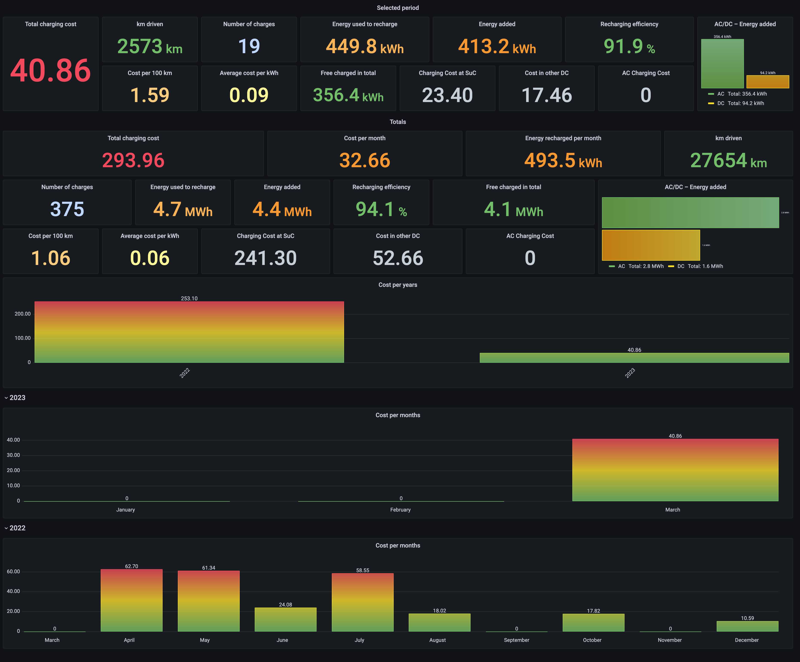

# TeslaMate - Custom dashboards for Grafana

Here you will find a series of original dashboards to expand those included by default in Teslamate to fully squeeze the data of your Tesla.

These **Custom Dashboards** have been tested with versions of Teslamate v1.27.1 and Grafana v8.5.6 or higher

---

## Import dashboards automatically with `dashboards.sh`

With this script (*dashboards.sh*), you can create or update automatically all dashboards. But, first of all, you need to generate a API KEY in your Grafana ([HOW-TO](#create-an-api-key)).

You have to execute the command `./dashboards.sh restore` modifying the URL and TOKEN variables as indicated in the example.

**URL** specifies the URL of the Grafana instance

**TOKEN** specifies the security key of the API, it's generated in Grafana.

```shell
URL=http://localhost:3000 TOKEN=XXXXXXXXXXXX ./dashboards.sh restore
```

Also, you can specify the source directory of the dashboards.

```shell
URL=http://localhost:3000 TOKEN=XXXXXXXXXXXX DESTINATION_DIRECTORY=/tmp/dashboards ./dashboards.sh restore
```

### HOW-TO: Create a Grafana API key

1. Sign in to Grafana, hover your cursor over Configuration (the gear icon), and click API Keys
2. Click "Add API key"
3. Enter a unique name for the key, e.g. "Import dashboards"
4. In "Role", select Admin option
5. In "Time to live" enter for example "1d" for 1 day, "1m" for 1 month or "1y" for 1 year
6. Click Add

More info in [Grafana documentation](https://grafana.com/docs/grafana/v8.5/administration/api-keys/create-api-key/) page.

---

## Import dashboards manually

1. Sign in to Grafana
2. Click in "Dashboards" option and select "Browse"
3. Create a personal folder, e.g. "Teslamate-Extra"
4. Go to new folder
5. Press the "Import" button
6. Press the "Upload JSON file" button
8. Select JSON file from your computer
8. And finally, press the "Import" button

---

## Screenshots

### Current Charge View


### Battery Health


### Charging Tops


### Charging Costs Stats



### Charging Curves


## Donations

Hello! 

If you like my work and want to support me, you can buy me a coffee, I would appreciate it a lot!

Your support helps me to keep improving these contents.

Thanks!

[](https://www.paypal.com/donate?hosted_button_id=QF2MBMQZP4V2J)

## Credits

- Author: Carlos Cuezva
- List of [contributors](https://github.com/CarlosCuezva/dashboards-Grafana-Teslamate/graphs/contributors)

## License

Distributed under [MIT license](./LICENSE)