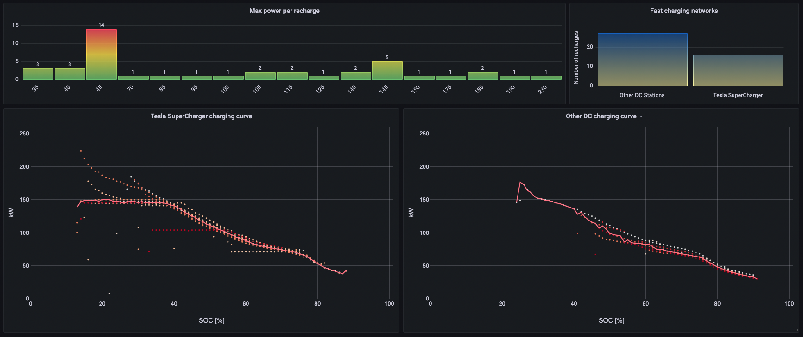

# TeslaMate - Custom dashboards for Grafana

## How to import boards

Tested with Teslamate v1.27.1 and Grafana v8.5.6

1. Sign in to Grafana
2. Create an API key (More information below)
3. Import dashboards one by one manually or run the *dashboards.sh* file to import them automatically

## Create an API key

1. Sign in to Grafana, hover your cursor over Configuration (the gear icon), and click API Keys
2. Click "Add API key"
3. Enter a unique name for the key, e.g. "Import dashboards"
4. In "Role", select Admin option
5. In "Time to live" enter for example "1d" for 1 day, "1m" for 1 month or "1y" for 1 year
6. Click Add

More info in [Grafana documentation](https://grafana.com/docs/grafana/v8.5/administration/api-keys/create-api-key/) page.

## Import dashboards manually

1. Click in "Dashboards" option and select "Browse"
2. Create a personal folder, e.g. "Teslamate-Extra"
3. Go to new folder
4. Press the "Import" button
5. Press the "Upload JSON file" button
6. Select JSON file from your computer
7. And finally, press the "Import" button

## Import dashboards automatically with *dashboards.sh*

With this script, you can create or update automatically all dashboards.

You have to execute the command "./dashboards.sh restore" modifying the URL and TOKEN variables as indicated in the example.

**URL** specifies the URL of the Grafana instance

**TOKEN** specifies the security key of the API, it's generated in Grafana.

``URL=http://localhost:3000 TOKEN=XXXXXXXXXXXX ./dashboards.sh restore``

## Screenshots

**Charging Tops**

**Charging Curves**

**Current Charge View**

**Charging Costs Stats**

## Credits

- Author: Carlos Cuezva – see [list of contributors](https://github.com/CarlosCuezva/dashboards-Grafana-Teslamate/graphs/contributors)
- Distributed under [MIT license](./LICENSE)
