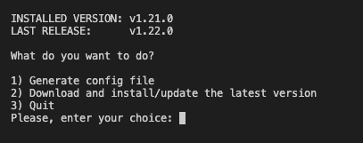
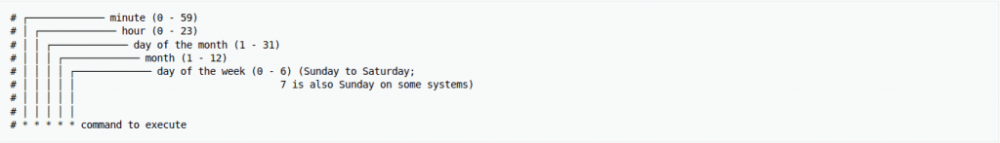
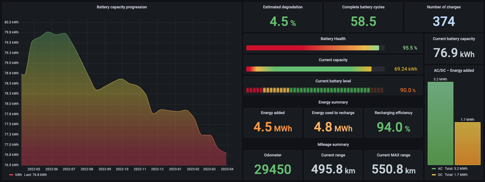
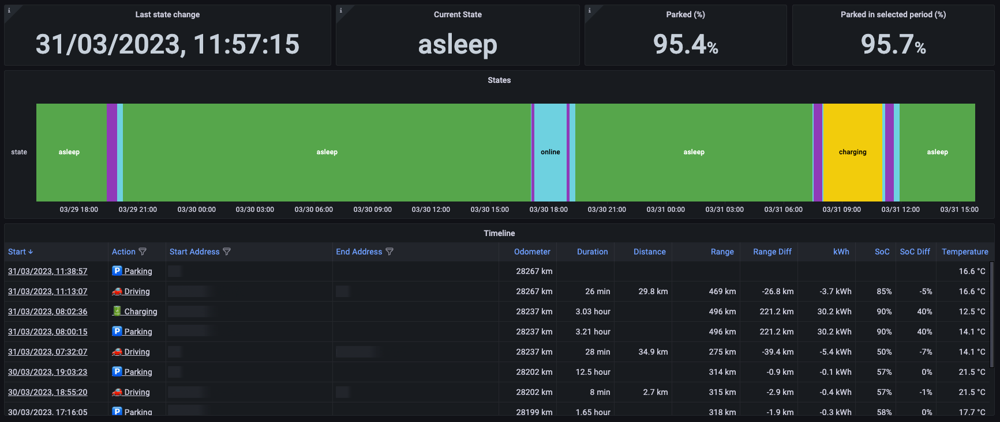
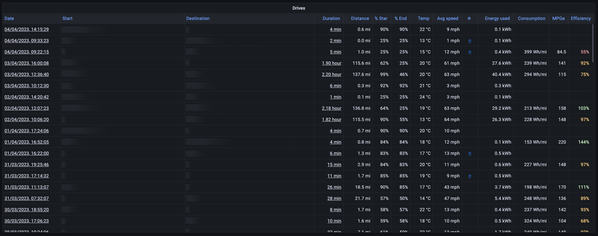
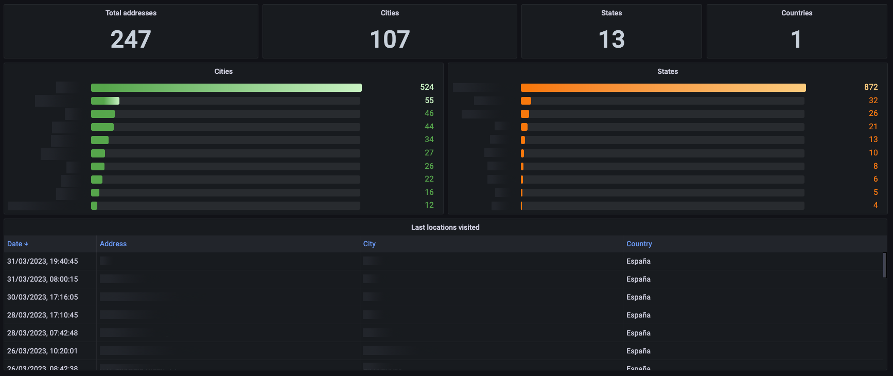
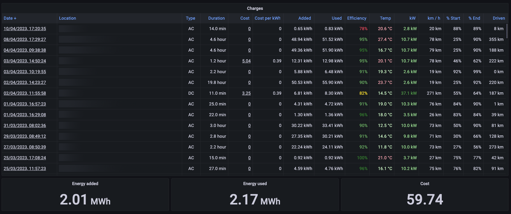

# TeslaMate - Custom dashboards for Grafana


[](https://www.paypal.com/donate?hosted_button_id=QF2MBMQZP4V2J)

Here you will find a series of original dashboards to expand those included by default in Teslamate to fully squeeze the data of your Tesla.

These **Custom Dashboards** have been tested with versions of Teslamate v1.27.1+ and Grafana v8.5.6 or higher

---

## Video guide in YouTube

Now you can see in Youtube the complete guide to install and update my Custom Dashboards for Teslamate.

👉 https://youtu.be/cwnxMrnym0I

The video has subtitles enabled.

---

## Import dashboards automatically with `dashboards.sh`

With this script (*dashboards.sh*), you can download de latest release and install automatically all dashboards. But, first of all, you need to generate a API KEY in your Grafana ([HOW-TO](#how-to-create-a-grafana-api-key)). You do not need to stop the Grafana service if you have it installed under docker and it will allow you to do it both locally and remotely.

If this is your first time using the new dashboards.sh, you have to generate a configuration file; don't worry, dashboards.sh will guide you step by step.



### Option 1: Generate config file

Attention! If you already had a configuration file created and you complete the wizard, it'll completely overwrite your previous configuration.

The questions that the wizard will ask you to generate the configuration file are the following:

- Enter the Grafana URL: Specifies the URL of the Grafana instance without `/` at the end (e.g. http://localhost:3000)
- Enter the Grafana TOKEN: Specifies the security key of the API, it's generated in Grafana ([HOW-TO](#how-to-create-a-grafana-api-key)).
- Path of the dashboards directory: Enter the relative or absolute path of the dashboards directory, default is `./dashboards`.

When you have completed the wizard, a file named `config.sh` will be created in the same directory as **dashboards.sh**.

### Option 2: Download and install/update the latest version

This option downloads the latest stable version published on [GitHub](https://github.com/CarlosCuezva/dashboards-Grafana-Teslamate). At the end of the process.

Next, all the dashboards that are in the indicated directory in your Grafana will be installed or updated.

### HOW-TO: Create a Grafana API key

1. Sign in to Grafana, hover your cursor over Configuration (the gear icon), and click API Keys
2. Click "Add API key"
3. Enter a unique name for the key, e.g. "Import dashboards"
4. In "Role", select Admin option
5. In "Time to live" enter for example "1d" for 1 day, "1m" for 1 month or "1y" for 1 year
6. Click Add

More info in [Grafana documentation](https://grafana.com/docs/grafana/v8.5/administration/api-keys/create-api-key/) page.

---

## Create cron job to autoupdate the Custom Dashboards

If you want, you can create a cron job and forget about updating the dashboards to the latest release.

The first thing you have to do is edit the crontab file of your user:

```bash
crontab -e
```

The format of a cron is as follows:



Here is an example that will run every day at 2am and the dashboards.sh file is located in the absolute path "/home/user/dashboards.sh".

```bash
0 2 * * * sh /home/user/dashboards.sh autoupdate > /dev/null
```

---

## Import dashboards manually

1. Sign in to Grafana
2. Click in "Dashboards" option and select "Browse"
3. Create a personal folder, e.g. "Teslamate - Custom"
4. Go to new folder
5. Press the "Import" button
6. Press the "Upload JSON file" button
7. Select JSON file from your computer
8. And finally, press the "Import" button

---

## Screenshots

### Current Charge View


### Battery Health



### Charging Tops


### Charging Costs Stats


### Charging Curves


### Drive Tops


### Tire Pressure


### Overview v2

<p style="text-align:center; font-style: italic;">Expanded version of the original Teslamate dashboard</p>


### States v2

<p style="text-align:center; font-style: italic;">Expanded version of the original Teslamate dashboard</p>



### Drives v2

<p style="text-align:center; font-style: italic;">Expanded version of the original Teslamate dashboard</p>



### Locations v2

<p style="text-align:center; font-style: italic;">Expanded version of the original Teslamate dashboard</p>



### Charges v2

<p style="text-align:center; font-style: italic;">Expanded version of the original Teslamate dashboard</p>



## Contributing

Feel free to help with Pull Requests when you were able to fix things or add new interesting information. I'll really appreciate any enhancement or suggestion.

## Coffee and referrals

If you like my work and want to support me, you can invite me a coffee, I'll appreciate a lot! Your support will help me to continue improving these contents.

<p style="text-align: center;">
    <a href="https://paypal.me/CarlosCuezva" target="_blank">
        https://paypal.me/CarlosCuezva
    </a>
</p>

Another way to support me is to use my referral code to purchase a Tesla product, we'll both get credits to redeem for exclusive rewards like free SuperCharger recharges, merchandise and accessories.

<p style="text-align: center;">
    <a href="https://ts.la/carlos45671" target="_blank">
        https://ts.la/carlos45671
    </a>
</p>

## Credits

- Author: Carlos Cuezva
- List of [contributors](https://github.com/CarlosCuezva/dashboards-Grafana-Teslamate/graphs/contributors)

## License

Distributed under [MIT license](./LICENSE)
