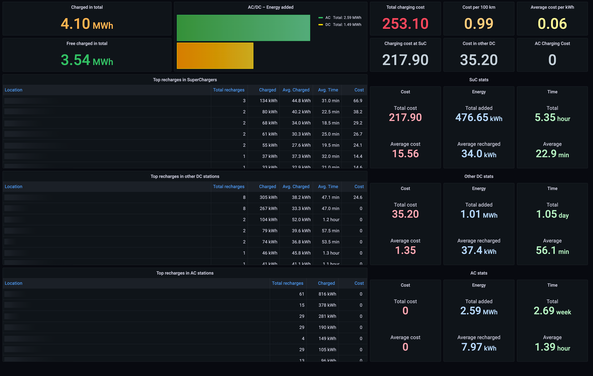

# Personal Grafana boards for Teslamate

## How to import boards

Tested with Teslamate 1.27.1

1. Login to Grafana
2. Click in "Dashboards" option and select "Browse"
3. Create a personal folder, e.g. "Teslamate-Extra"
4. Go to new folder
5. Press the "Import" button
6. Press the "Upload JSON file" button
7. Select JSON file from your computer
8. Select the appropiate Teslamate datasource from the available droplist.
9. And finally, press the "Import" button

## Screenshots

**Charging Tops**

**Charging Curves**

**Current Charge View**

## Contributing

If you are able to contribute with more Custom Grafana Dashboards just fork this repository and make a pull request. I'll really appreciate any improvement or suggestion.

## Credits

- Author: Carlos Cuezva – see [list of contributors](https://github.com/CarlosCuezva/dashboards-Grafana-Teslamate/graphs/contributors)
- Distributed under [MIT license](./LICENSE)
